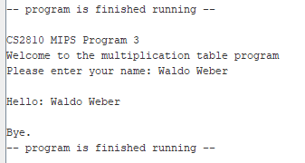
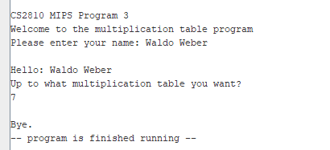
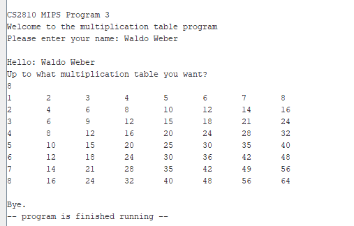

# 1. MIPS Programming Assignment 3

- [1. MIPS Programming Assignment 3](#1-mips-programming-assignment-3)
	- [1.1. Objective and Purpose](#11-objective-and-purpose)
	- [1.2. Overview](#12-overview)
		- [Sample code: Task 0](#sample-code-task-0)
	- [Task 1: Print Assignment information](#task-1-print-assignment-information)
		- [Task 1: Sample Output](#task-1-sample-output)
	- [Task 2: Capture Integer Input](#task-2-capture-integer-input)
		- [Task 2: Sample Output](#task-2-sample-output)
	- [Task 3: Display Multiplication Tables](#task-3-display-multiplication-tables)
		- [Task 3: Sample Output](#task-3-sample-output)
	- [1.7. Submission Checklist](#17-submission-checklist)

## 1.1. Objective and Purpose

This assignment we will explore how to allocate space in the stack, as well as the use of loops and procedures as well as some multiplication calls. 
- Read string from standard input and save it to memory.
- Read integer from standard input and save it to memory.
- Use nested loop to display multiplication tables.
- Use Procedures

Note: Make sure you include the pseudo-code in the comments, as well as those registers you
plan to use for the algorithm. 

## 1.2. Overview

Write and test a friendly MIPS assembly program that takes user input and prints a string a
number of times. Specifically, your program should be divided into the following four sections,
which must perform several specific tasks

###  Sample code: Task 0

Use the `la` folder of this project to save all the practice programs we discussed in the video lectures.

## Task 1: Print Assignment information

Create a procedure called `user_info` that does the following: 

- Prints your program information (`info` string).
- Asks for your name (`prompt0` string)
- Captures and stores your input `in memory`  (`name` space) 
- Displays a welcome message for the user (`message` string + `name`)

Inside `main` call the procedure using the `jal` instruction. 

### Task 1: Sample Output

## Task 2: Capture Integer Input

Still inside `main`, ask user to enter up to what multiplication table they need (`prompt1` string). Then, make sure you save/`store` the input into memory. 

Note: Do not keep it in a register

### Task 2: Sample Output

## Task 3: Display Multiplication Tables

Your last task is to create another procedure called `mult_table` that displays the multiplication tables from `1` up to the number you stored in the `num` word. 

Note: Make sure your numbers are aligned. 

Hint: print `tab` string after each print.

### Task 3: Sample Output

## 1.7. Submission Checklist

- [x] Task 0: Save your lecture scripts in the `la` folder
- [x] Tasks: Complete all tasks
- [x] Save and `commit` your code in github desktop
- [x] `Push` the code to `github.com`
- [x] Upload video of your code walkthrough in `Canvas`
- [x] Add your github repo `as a comment` to your assignment in `Canvas`.
